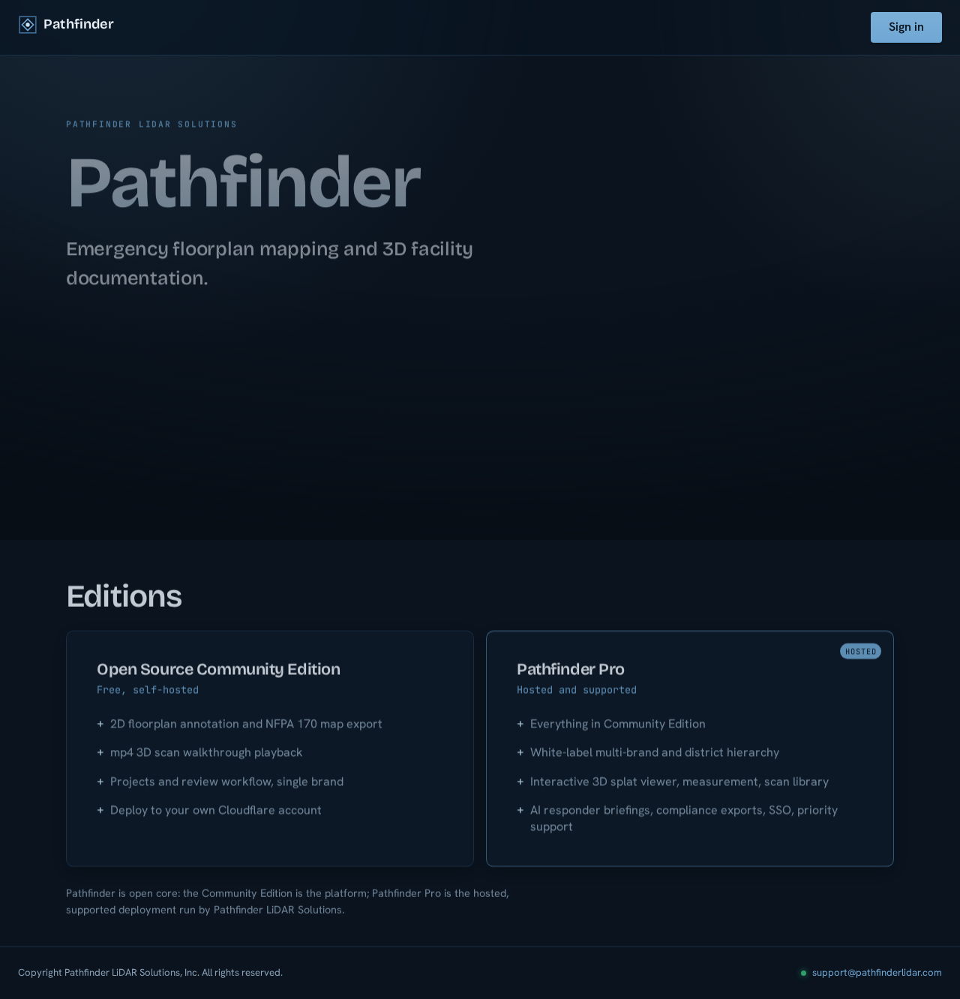
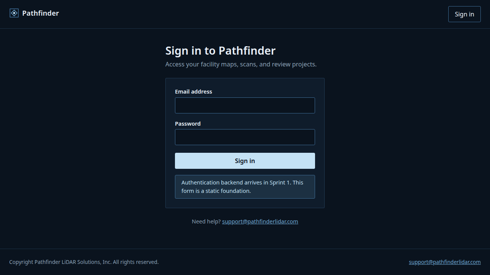
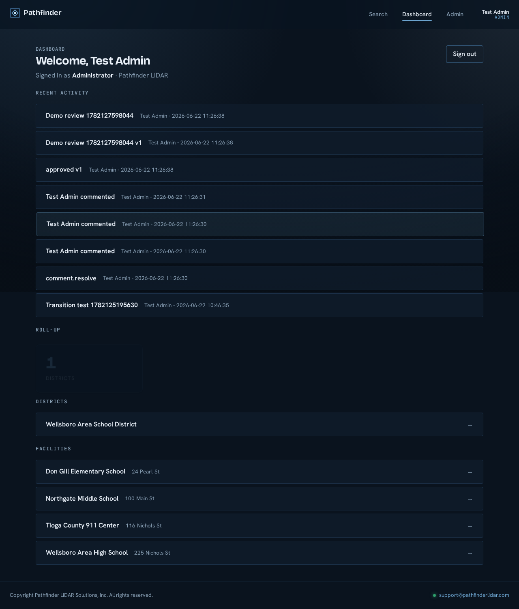
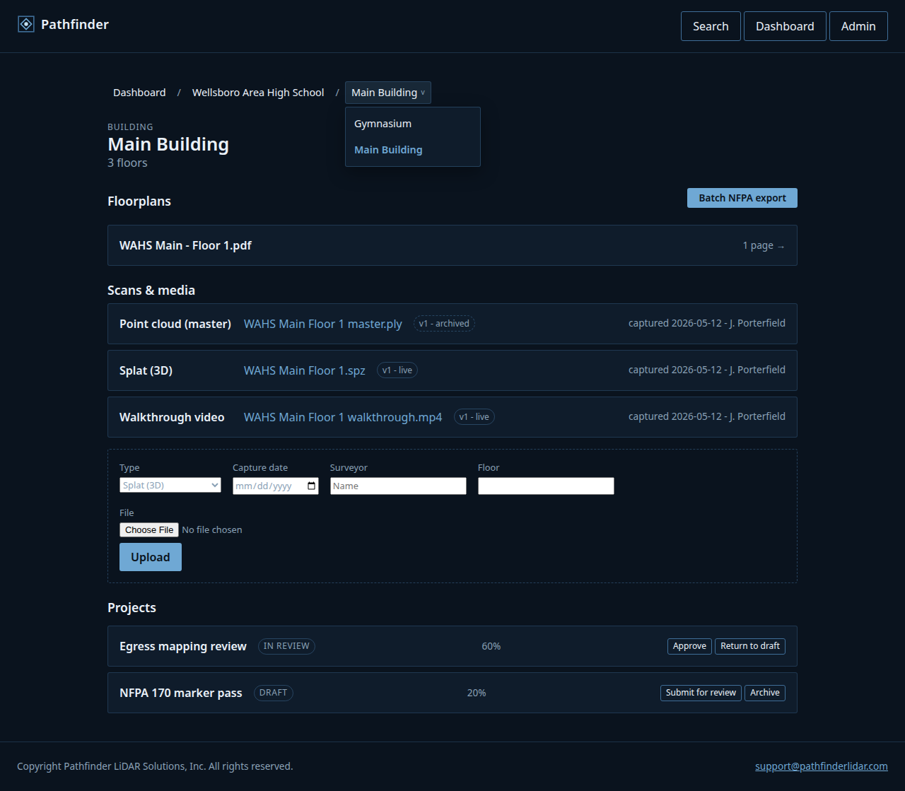

<div align="center">

# Pathfinder

### Emergency floorplan mapping and 3D facility documentation. Open source, white-label.

*A platform by [Pathfinder LiDAR Solutions](https://pathfinder-lidar.pages.dev).*

[](./LICENSE)
[](#testing-tdd)
[](#architecture)
[-a9cce3)](#3d-scans)
[](#editions)

[Live demo](https://pathfinder-c3o.pages.dev) - [Specification PDF](./docs/pdf/Pathfinder-Specification.pdf) - [Sprint plan PDF](./docs/pdf/Pathfinder-Sprint-Plan.pdf) - [All docs](#documentation)

</div>

---

Pathfinder is a web portal where facility owners (schools, 911 centers, universities, government,
healthcare) and the teams that map them collaborate on emergency floorplans, place NFPA-standard
safety markers, and explore survey-grade 3D scans of the building - mp4 walkthroughs plus interactive
Gaussian-splat scenes captured with FJD Trion LiDAR. It exports responder-ready printed maps and
NG911-aligned data.

It is a ground-up SvelteKit rewrite of the original ELS911 portal that keeps the battle-tested 2D
annotation and NFPA map-export engines and adds 3D scans, a multi-school hierarchy, collaboration,
global search, and a drop-in white-label brand layer. The market gap it targets: incumbents
(CRG, Navigate360, Raptor) ship verified 2D plans and 360-degree photos; Pathfinder makes a true
measurable 3D digital twin the primary artifact.

## Screenshots

The portal as built, captured by the Playwright suite (`npm run test:e2e`) and stored in
[`tests/e2e/__screenshots__/`](./tests/e2e/__screenshots__/) - regenerated on every test run.

| Landing | Login |
|---|---|
|  |  |

| Roll-up dashboard | Hierarchy browse |
|---|---|
|  |  |

## Editions

Pathfinder is **open core**: a genuinely useful free edition you can self-host, and a commercial
hosted edition (Pathfinder Pro) operated by Pathfinder LiDAR Solutions with paying customers.

| | Community Edition | Pathfinder Pro |
|---|---|---|
| License | AGPL-3.0 (this repo) | Commercial ([`COMMERCIAL.md`](./COMMERCIAL.md)) |
| Hosting | Self-host | Hosted SaaS by Pathfinder LiDAR |
| Branding | Single brand | **White-label, multi-brand, drop-in** |
| 2D annotation engine | Yes | Yes |
| NFPA safety mapping + PDF export | Yes (single map) | Yes + **batch pipeline** |
| 3D scans | **mp4 walkthrough playback** | + **interactive splat viewer, measurement, 3D markers, version compare** |
| Org hierarchy + dashboards | Single org | **District > Facility > Building** |
| Collaboration | Comments + resolve | + **@mentions, email notifications, share links** |
| Global search | Per project | **Cross-org** |
| Compliance | In-app audit log | + **NG911/NENA export, audit export, trust page** |
| Auth | JWT + roles | + **SSO/SAML/MFA** |
| Billing | n/a | **Stripe subscriptions** |
| Support | Community | Priority + SLA |

Full breakdown and the third-party-service list: [Editions & Integrations](./docs/06-editions-and-integrations.md)
([PDF](./docs/pdf/Pathfinder-Editions-Integrations.pdf)).

## Features

Fourteen epics define the product. Status reflects what is built in this repo today.

| Epic | Capability | Status |
|---|---|---|
| E1 White-label brand layer | Drop-in brand profiles; token-driven theming; Pathfinder + ELS911 profiles | Built |
| E2 Identity, roles and access | JWT + API keys; RBAC admin/staff/client; audit log; hardened auth | Built |
| E3 Org hierarchy and dashboards | Org > District > Facility > Building; roll-ups; breadcrumb switchers | Built |
| E4 Project and review workflow | Projects, status, progress, members; review loop; approvals | Built |
| E5 2D floorplan annotation engine | Ported PDF.js + canvas; 12 tools; JSON export | Built |
| E6 Safety mapping and NFPA export | NFPA symbol library; legend autofit; batch PDF; z-axis floor labels | Built |
| E7 Unified scan library and media | media_assets; versioning; R2 multipart upload; cold archive | Built |
| E8 3D scan viewer | mp4 + Spark splat viewer; 3D measurement; anchored markers; floor switching | Built |
| E9 Collaboration | Anchored comments; resolve; @mentions; activity feed; batched email; share links | Built |
| E10 Global search | FTS5 across facilities/buildings/projects/documents/markers | Built |
| E11 Compliance and trust | NG911/NENA GeoJSON export; immutable audit; staleness flags; trust page | Built |
| E12 Accessibility | WCAG 2.1 AA contrast; keyboard nav; screen-reader labels; non-visual map alternative; VPAT | Built |
| E13 Admin and platform ops | User + API-key management; audit viewer; settings; observability | Built |
| E14 Quality and delivery harness | TDD: Vitest + Playwright screenshots; CI; deploy to CF | Built |

<details>
<summary>Personas</summary>

- **Operator admin** - runs a Pathfinder deployment under its own brand (Pathfinder LiDAR, ELS911, a reseller).
- **Mapping staff** - uploads plans/scans, places markers, runs reviews.
- **District safety director / client** - reviews maps for their facilities, comments, approves.
- **First responder (read-only)** - finds what they need inside a building before they arrive.
</details>

## Architecture

Shell rewrite, engine port: the app shell is SvelteKit; the proven imperative engines (2D annotation,
map/NFPA export) and the new 3D splat viewer are framework-agnostic modules mounted into thin
components - modernized structure without re-litigating logic that already works.

```
Browser (SvelteKit + Svelte 5)
  routes/  +page.svelte  ............ UI, brand-tokenized (var(--brand-*))
  lib/engines/ 2d-annotate | map-export | splat-viewer (mounted modules)
        |
  hooks.server.ts  ................. auth context, route guards, security headers
        |
  routes/api/**/+server.ts  ........ API (replaces v1 Pages Functions catch-all)
        |
Cloudflare
  D1 (DB) ........ SQLite: users, hierarchy, projects, annotations, media, audit
  R2 (DOCUMENTS) . PDFs, point clouds, SPZ splats, mp4 walkthroughs (cold archive for masters)
  KV (CACHE) ..... sessions, rate-limit counters
```

| Layer | Choice |
|---|---|
| Framework | SvelteKit (Svelte 5) + `@sveltejs/adapter-cloudflare` |
| Database | Cloudflare D1 (SQLite), parameterized queries, migrations in `migrations/` |
| Storage | Cloudflare R2 (SPZ splats delivered; master PLY archived cold, never served) |
| Cache / sessions | Cloudflare KV |
| 2D | PDF.js (pinned) | 
| 3D | Spark (THREE.js, WebGL2), SPZ format |
| Auth | JWT HS256 (Web Crypto) + PBKDF2-SHA256 passwords + API keys |
| Tests | Vitest (unit) + Playwright (e2e, screenshots) |
| Deploy | `wrangler pages deploy` (direct) |

Full detail, data model, and API surface: [Specification](./docs/01-specification.md)
([PDF](./docs/pdf/Pathfinder-Specification.pdf)).

## 3D scans

The pipeline is **FJD Trion P1 scanner -> Trion Model (Gaussian splatting + mp4) -> SPZ**.

- **mp4 walkthrough** plays everywhere, zero friction - the responder baseline.
- **Interactive splat viewer** (Spark, WebGL2, 98%+ device support) appears when a splat asset exists,
  with orbit/fly/walk, point-to-point **measurement**, **3D-anchored markers** (exits, hazards, AED),
  **floor switching**, named **viewpoints**, and **version compare**.
- **SPZ** is the delivery format: ~90% smaller than PLY, mobile-safe; master PLY is archived in cold
  R2 and never served to clients.

Why this matters for responders, and the library/format analysis: [research/03](./docs/research/03-3d-splat-viewer.md).

## Security and compliance

Facility safety maps are sensitive-but-unclassified - a blueprint of exits, shutoffs, and chokepoints
is itself a risk if leaked. The code is public; **secrets and real facility data never are**.

- **Auth hardening (shipped, audited):** PBKDF2-SHA256 (100k iters) with constant-time comparison,
  HS256 JWT with pinned alg and fail-closed secret, httpOnly/Secure/SameSite cookies, 12h token TTL
  with token-version revocation, KV-backed login rate limiting/lockout, anti-enumeration decoy hashing,
  input caps, and security headers (CSP, HSTS, X-Frame-Options, nosniff). Every data route enforces
  authorization server-side; clients cannot see other orgs' data.
- **Standards the product targets:** NFPA 170 symbols, NFPA 3000 pre-incident planning, Alyssa's Law
  mapping mandates, NG911/NENA z-axis floor labeling, FERPA "school official" DPA, immutable audit logs,
  **WCAG 2.1 AA** (ADA Title II). Any one gap can disqualify a gov/edu bid.

Background and requirement implications: [research/02](./docs/research/02-compliance-standards.md).
Reporting a vulnerability: see [SECURITY.md](./SECURITY.md).

## White-label in one step

The brand layer (`src/lib/brand/`) is the single source of truth. To rebrand:

1. Add a profile: `src/lib/brand/profiles/<id>.ts` (name, logo, colors, fonts, contact, legal).
2. Set `VITE_BRAND=<id>`.

No component edits - every component reads `var(--brand-*)` tokens. Ships with the **Pathfinder**
(default) and **ELS911** profiles.

## Quick start

```bash
npm install
npm run dev            # http://localhost:5173

# Cloudflare D1 (local) - migrate + seed a dev admin
npm run db:migrate:local
npm run db:seed:local       # creates test@test.com / test1234 (admin)
npm run db:seed:hierarchy:local

npm run check          # svelte-check (type/diagnostics)
npm run test:unit      # Vitest
npm run test:e2e       # Playwright (captures screenshots)
npm run build
npm run deploy         # wrangler pages deploy (direct)
```

Secrets (`JWT_SECRET`, etc.) live in `.dev.vars` locally (gitignored) and Cloudflare secrets in
production. The app fails closed if a real `JWT_SECRET` is not set in production.

## Testing (TDD)

Pathfinder is **test-first**. Every acceptance criterion in
[`docs/03-acceptance-criteria.md`](./docs/03-acceptance-criteria.md) maps to a test; user-visible
behavior is verified with Playwright screenshots committed to the repo. Current suite:
**164 unit + 45 e2e passing**. The mapping from criteria to test-writing prompts is the
[TDD Plan](./docs/04-tdd-plan.md) ([PDF](./docs/pdf/Pathfinder-TDD-Plan.pdf)). Rules every
contributor (human or AI) follows: [`AGENTS.md`](./AGENTS.md).

## Roadmap

An aggressive one-week delivery, Monday to Monday. S0 is the inherited v1 baseline; scope per
sprint is unchanged from the full plan, only compressed in time.

| Day | Sprint | Theme | Status |
|---|---|---|---|
| (before) | S0 | Inherited v1 engines + schema baseline | Complete (inherited) |
| Monday | S1 | Foundation: scaffold, brand layer, auth, test harness | Complete |
| Tuesday | S2 | Org hierarchy + roll-up dashboards | Complete |
| Wednesday | S3 | Engine port: 2D annotation + map/NFPA export | Complete |
| Thursday | S4 | Unified scan library + R2 multipart upload | Complete |
| Friday | S5 | 3D viewer: mp4 + Spark splat + measurement + 3D markers | Complete |
| Saturday | S6 | Global search + batch export + collaboration | Complete |
| Sunday | S7 | Compliance, accessibility, migration, launch | Complete |
| (next) Monday | - | Launch / handoff | Complete (deployed) |

Full plan with per-sprint detail, Definition of Done, and risk register:
[Sprint Plan](./docs/05-sprint-plan.md) ([PDF](./docs/pdf/Pathfinder-Sprint-Plan.pdf)).

## Documentation

Every document has a polished, shareable PDF in [`docs/pdf/`](./docs/pdf/) (rebuild with
`node docs/pdf/build.mjs`).

| Document | Markdown | PDF |
|---|---|---|
| Specification (architecture, data model, API, security) | [01](./docs/01-specification.md) | [PDF](./docs/pdf/Pathfinder-Specification.pdf) |
| User Stories (70 stories, 14 epics) | [02](./docs/02-user-stories.md) | [PDF](./docs/pdf/Pathfinder-User-Stories.pdf) |
| Acceptance Criteria (97 Given/When/Then) | [03](./docs/03-acceptance-criteria.md) | [PDF](./docs/pdf/Pathfinder-Acceptance-Criteria.pdf) |
| TDD Plan (test-writing prompts) | [04](./docs/04-tdd-plan.md) | [PDF](./docs/pdf/Pathfinder-TDD-Plan.pdf) |
| Sprint Plan (one-week roadmap) | [05](./docs/05-sprint-plan.md) | [PDF](./docs/pdf/Pathfinder-Sprint-Plan.pdf) |
| Editions and Integrations | [06](./docs/06-editions-and-integrations.md) | [PDF](./docs/pdf/Pathfinder-Editions-Integrations.pdf) |
| Canonical context (internal source of truth) | [00](./docs/00-canonical-context.md) | - |

<details>
<summary>Research briefs (cited)</summary>

- [Competitive landscape](./docs/research/01-competitive-landscape.md) - CRG, Navigate360, Raptor, RapidSOS; table stakes vs the 3D gap to own.
- [Compliance and standards](./docs/research/02-compliance-standards.md) - NFPA 170/3000, Alyssa's Law, NG911/NENA, FERPA, WCAG.
- [3D scanning and Gaussian splats](./docs/research/03-3d-splat-viewer.md) - responder needs; Spark + SPZ; pipeline and storage.
- [Portal UX and documentation conventions](./docs/research/04-portal-ux-and-docs.md) - IA, collaboration, trust, doc templates.
</details>

## Project status

S0 (inherited v1 engines) baseline; **S1 (auth, hardened) and S2 (hierarchy + dashboards) complete**,
deployed to the test project at [pathfinder-c3o.pages.dev](https://pathfinder-c3o.pages.dev). 50 unit +
6 e2e tests green. Remaining sprints port the 2D engine, add the scan library, 3D splat viewer, search,
collaboration, and compliance.

## Contributing

See [`CONTRIBUTING.md`](./CONTRIBUTING.md) and [`AGENTS.md`](./AGENTS.md). Test-first, Conventional
Commits, ASCII commit messages, never commit secrets or real facility data.

## License

Community Edition: [AGPL-3.0](./LICENSE). Commercial licensing for Pathfinder Pro: see
[`COMMERCIAL.md`](./COMMERCIAL.md). Copyright (c) 2026 Pathfinder LiDAR Solutions.
